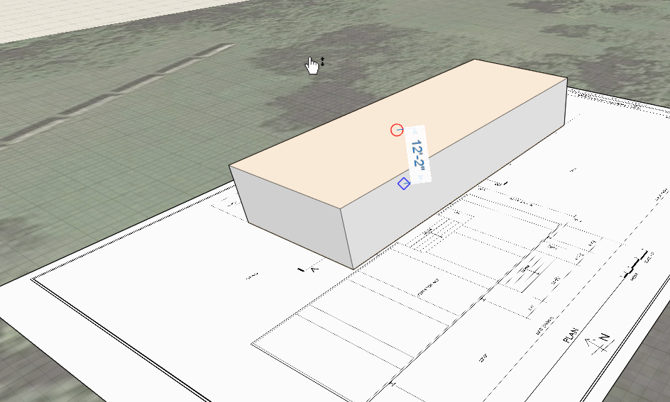

### 3D スケッチ

---

> プリミティブの配置機能は便利な機能ですが、FormIt の真価は 3D でのスケッチ機能にあります。直前の演習では、回転ツールを使用した場合のスナップ機能の仕組みについて確認しました。直線の演習がまだ完了していない場合は、[FormIt Primer フォルダ](https://autodesk.app.box.com/s/thavswirrbflit27rbqzl26ljj7fu1uv/1/9025446442)から **farnsworth01.axm** ファイルをダウンロードして演習を完了してください。

---

#### 線分ツールを使用して 3D スケッチを行う

1. イメージの作業面をグループ化してスケッチ線の重なりを防ぐには、作業面をダブルクリックして選択し、**[グループ(G)]**を右クリックして選択します。

2. **鉛筆アイコン**をクリックして[**スケッチ ツールバー**](../formit-introduction/tool-bars.md)を開きます。

3. [**[線分ツール(L)]**](../tool-library/line-tool.md)を選択します。

4. 線分セグメントを使用して、すぐにスケッチを開始することができます。ワールド軸を使用して 3D スケッチを行う方法については、[**ここ**](../tool-library/world-axes.md)をクリックしてください。

5. 地盤面上に長方形を作成します。

* [設定]をクリックして**[グリッドにスナップ(S G)]**を無効にします。
* **線分ツール**を使用して、読み込んだスケッチの**いずれかの角**をクリックします。 次に、その角を**ドラッグ**して、上部テラスの一方の端を作成します。
* 正確な寸法を入力するには、**[Tab]キー**を使用します。 長辺の値を **77'-4 1\8"**、短辺の値を **28'-8"** に設定します。
* **Esc** キーを押します。 選択モードに戻ります。この状態で上面を選択し、**12'-2"** まで引き上げて体積を増やします。

**注**: *赤と緑の軸によって 90 度が保たれます。 グリッドに対して特定の角度を描画すると紫色のガイド線が表示され、現在の線分に対して 90 度を保つことができます。*

#### オプション – その他のツールを使用して 3D スケッチを行う

---

> 次の演習は、家屋の仕上げを行うために必須の演習ではありませんが、その他の 3D スケッチツールの仕組みを理解することができます。

---

1. [**アクション ツールバー**](../formit-introduction/tool-bars.md)でスケッチ ツール(鉛筆アイコン)を選択し、[**円弧ツール**](../tool-library/arc-tool.md)を選択します。

* 線分ツールの場合と同様に、最初の点と 2 番目の点をクリック操作で指定します。
* 次に、上記手順で作成した直線をドラッグして、円の半径を指定します。これが円弧になります。
* **注:** *赤いスナップを使用して、シーン内の他のオブジェクトにスナップすることができます。これは、すべてのスケッチ ツールに共通する機能です。*

2. [**スプライン ツール**](../tool-library/spline-tool.md)を選択します。

* クリック操作により、スプラインを描画するための点を必要な数だけ指定することができます。

3. [**円ツール**](../tool-library/circle-tool.md)を選択します。

* 円の上にカーソルを移動し、クリック操作で円の中心点を指定します。
* 円をクリックし、ドラッグ操作で円の半径を指定します。

**重要:** *他の点、線分、オブジェクトの面/端/点に曲線セグメントをスナップすると、スナップ元とスナップ先が 1 つのオブジェクトとして結合されます。 これを避けるには、グループ機能を使用します。この機能については、これ以降の演習で説明します。*

