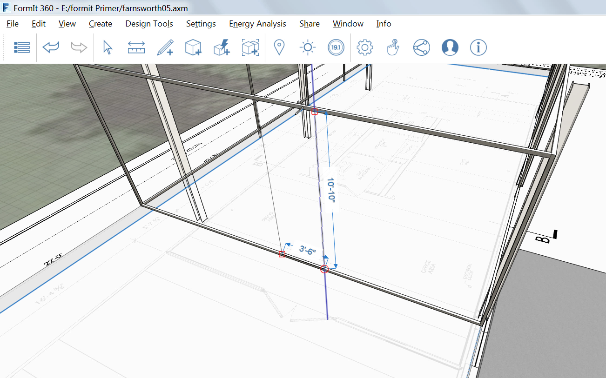

### 詳細の追加

---

> 直前の演習がまだ完了していない場合は、[FormIt Primer フォルダ](https://autodesk.app.box.com/s/thavswirrbflit27rbqzl26ljj7fu1uv/1/9025446442)から **farnsworth04.axm** ファイルをダウンロードして演習を完了してください。

---

#### ドア フレーム

この演習では、2" のメタル フレームと、窓ガラスを囲むマリオンを作成します。

1. 屋根レイヤを**非表示**にします。

2. [**長方形ツール(R)**](../tool-library/rectangle-tool.md)を使用して、窓ガラスの西面の上部にサーフェスを描画します。

3. [**オフセット面ツール(OF)**](../tool-library/extrude-cut-and-offset-faces.md)と**[Tab]キー**を使用して、別の長方形を室内の方向に **2"** オフセットします。

4. フレームを**選択**し、室内の方向に 2" **押し出し**ます。

5. アセンブリをグループ化して「**EW Frame**」という名前を付けます。

6. マテリアルの**[メタル] > [陽極酸化 – グレー]**を使用して、柱の読み込みとペイントを行います。

7. 建物の東側にアセンブリを[**コピー**または**配列**](../tool-library/tilt-array-copy-and-paste.md)します。

8. 建物の北側と南側についても、手順 1 ～ 6 を繰り返します。

#### マリオンの作成

1. 直前の演習と同じ方法で、厚さと奥行きが 2" のマリオン(**11'-10 ¾"**)を、北西のコーナーから作成します。

2. マリオンの高さを、すべてのガラス壁と同じ高さにします(11'-10")。

3. アセンブリをグループ化して「**mullion**」という名前を付けます。

4. マテリアルの**[メタル] > [陽極酸化 – グレー]**を使用して、柱の読み込みとペイントを行います。

5. **11'** の距離で、マリオンの[**配列**](../tool-library/tilt-array-copy-and-paste.md)を 3 回繰り返します。

6. **[Tab]キーを押しながらマウスを操作して**すべてのマリオン インスタンスを選択し、壁の南側に**コピー**します。

#### ドアの作成

直前の 2 つの演習と同じ方法で、西側の壁の中心に 3'-6" の二重ドアを作成します。

---

#### 関連項目

[**かぶり、スイープ、ロフト**](../tool-library/cover-sweep-loft.md)

