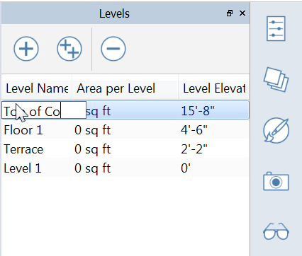
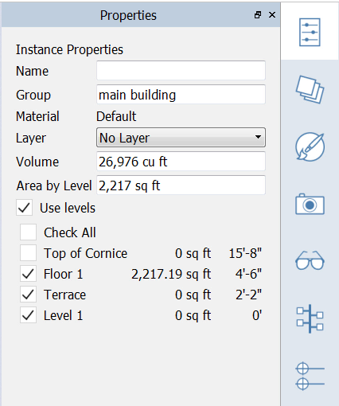

### レベル

---

> レベルを使用してマスを個々の床に分割し、プロジェクト全体の総面積を計算したり、建物ごとの面積を計算することができます。ファイルを変換すると、レベルが Revit 用に変換されます。

---

#### レベルを作成、編集、および適用する

1. [**パレット バー**](../formit-introduction/tool-bars.md)の**レベル パレット**を使用して、新しいレベルを使用することができます。

2. **[+]** (**レベルを追加**)を 4 回クリックして、1 つのレベルをそれぞれ **0'-0"、2'-2"、4'-6"**、**15'-8"** で追加します(**[++]**アイコンをクリックして、複数のレベルを作成することもできます。高い建物の場合に便利です)。

3. レベルの名前をクリックして**レベル名を編集**します。 各レベルに、**Level 1、Terrace、Floor 1、****Top of Cornice** という名前を付けます。これらのレベル名が Revit 用に変換されます。

4. **メインのマス**を選択して[**プロパティ パレット**](../formit-introduction/tool-bars.md)の**[レベルを適用]**をクリックし、メインの床だけを選択します。 この操作により、このマスの領域情報がプロパティ パレットに読み込まれます。****

