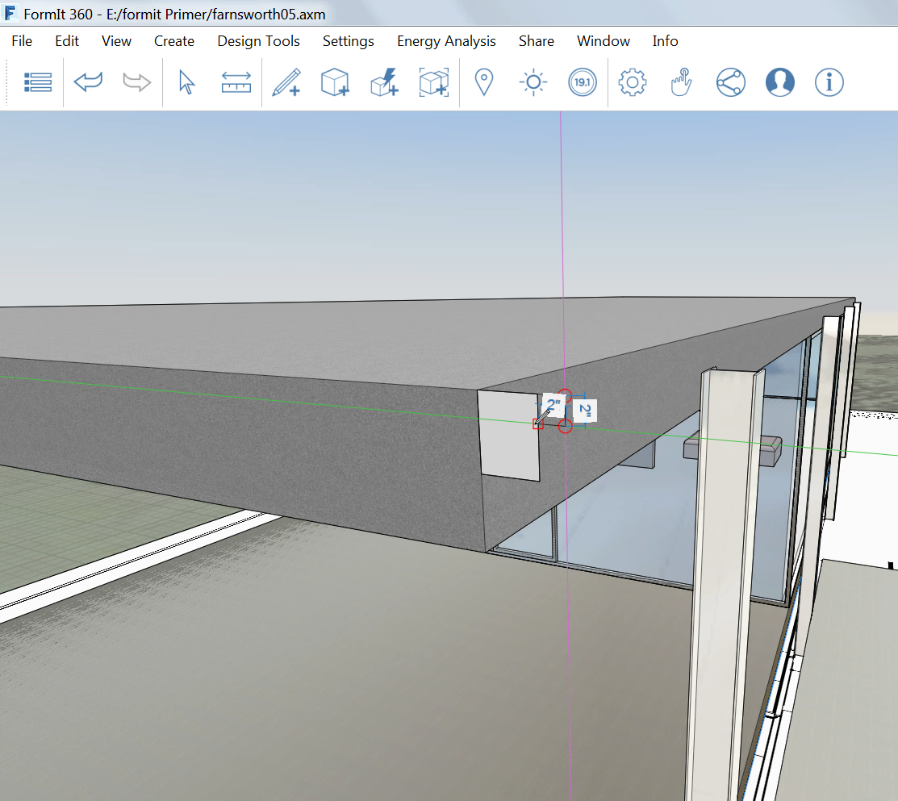

### 高度なモデリング

---

> 直前の演習がまだ完了していない場合は、[FormIt Primer フォルダ](https://autodesk.app.box.com/s/thavswirrbflit27rbqzl26ljj7fu1uv/1/9025446442)から **farnsworth05.axm** ファイルをダウンロードして演習を完了してください。

---

#### 高度なモデリング – フィレット

土台部分の端を丸めるには、フィレット ツールを使用します。

1. 家屋の居住域に、サイズが **4' x 7' x 1'-6"** の長方形を作成します。

2. [**アクション ツールバー**](../formit-introduction/tool-bars.md)の**[高度なモデリング ツール]**で[**フィレット ツール(FI)**](../tool-library/cover-sweep-loft.md)を選択します。

3. 上面を選択し、フィレットの距離として **2"** を選択します。 左上隅の**チェック マーク**をクリックして、操作を終了します。   
---

#### 高度なモデリング – スイープ

屋根に沿ってコーニスを作成するには、スイープ ツールを使用します。

1. 屋根の南西角に、サイズが **6" x 4 5/8"** の長方形を作成します。

2. 3D スケッチ機能を使用して、サイズが **2" x 2"** のリビールを作成します。

3. 2 つの長方形の間にある線を**削除**して、1 つの形状を作成します。

4. [**[高度なモデリング]メニュー**で](../formit-introduction/tool-bars.md)[**スイープ ツール(SW)**](../tool-library/cover-sweep-loft.md)を選択します。   

5. スイープする形状を選択します。

6. 屋根の上面をパスとして選択します。次に**チェック ボックス**をクリックして、スイープを完了します。

7. マテリアルの**[コンクリート] > [白]**を使用してコーニスの読み込みとペイントを行い、屋根に一致させます。

