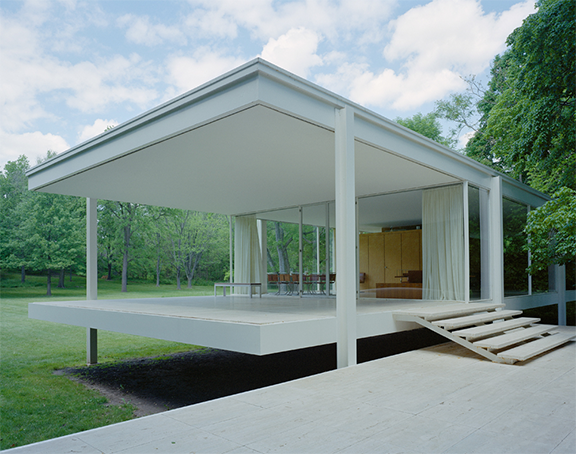

> バージョン 0.1、©2016 Autodesk, Inc. 2016 年 7 月 13 日

### ファンズワース邸の建築

このチュートリアルでは、FormIt の各種ツールと、モダニズム建築の象徴であるファンズワース邸をわずか 2 時間で建築する方法について説明します。ここで紹介する各種のツールバー、ツール、操作の詳しい説明については、[**ツール ライブラリ**](../tool-library/tool-library.md)を参照してください。

#### このチュートリアルの前提条件:

* FormIt の「[**前提条件とインストール**](../formit-introduction/prerequisites-and-installation.md)」セクションに記載されている説明に従って、FormIt 360 のダウンロードとインストールを実行してください。
* データセットは、[**Autodesk Primer データ セット**](https://autodesk.app.box.com/s/thavswirrbflit27rbqzl26ljj7fu1uv)からダウンロードしてください。

**注:** * FormIt 360 for Windows を実行できない場合でも、Web で公開されている無料の* [**Windows 用アプリケーション**](http://formit360.autodesk.com/app)を使用すれば、ほとんどのチュートリアルを受講することができます。

