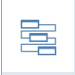
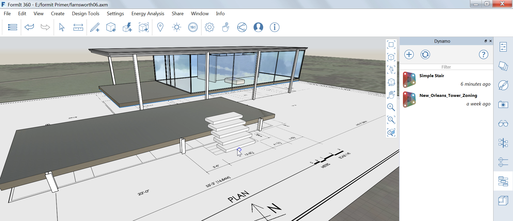

### Dynamo の計算グループ

---

> このセクションでは、[Dynamo](http://dynamobim.org/) の計算機能を使用して、柔軟なグループの配置と変更を行う方法について説明します。

> 直前の演習がまだ完了していない場合は、[FormIt Primer フォルダ](https://autodesk.app.box.com/s/thavswirrbflit27rbqzl26ljj7fu1uv/1/9025446442)から **farnsworth06.axm** ファイルをダウンロードして演習を完了してください。

---

#### Dynamo グループの配置と変更

1. パレット バーで [**Dynamo パレット**](../formit-introduction/tool-bars.md)を開きます。

2. **[+]**アイコンをクリックします。

3. [https://www.dynamoreach.com/share/5780fb888794379c4b65b941](https://www.dynamoreach.com/share/5780fb888794379c4b65b941) という URL をボックス内に貼り付けます。

4. 上記の手順により、これまでの演習で作成した「Simple Stair」という名前の Dynamo グループがロードされます。**パレット内のアイコン**をクリックすると、シーン内に階段がロードされます。

5. **平面図ビュー**に移動して、下部テラスの階段部分が平面図に表示される位置を大まかな中心位置として、**階段を配置**します。

6. 対象のグループをダブルクリックして編集し、[**プロパティ パレット**](../formit-introduction/tool-bars.md)に移動します。

7. 設定を次のように変更します。   

8. グループ(階段)を配置したら、そのグループを上部テラスに**コピー**します。 コピーしたグループを右クリックし、**[ユニークにする(M U)]**を選択します。

9. コピーしたグループをダブルクリックして編集し、**フロア間の高さの設定値**を **1.5 に変更**します。

