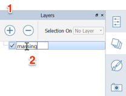

### レイヤ

---

> AutoCAD や Photoshop と同様に、FormIt のレイヤを使用して、シーン内のオブジェクトの表示設定を管理することができます。この演習では、今後の解析で使用する建築マスの保存と非表示を行うためのレイヤを作成します。

---

1. [**レイヤ パレット**](../formit-introduction/tool-bars.md)をクリックし、**[+]**記号を 2 回クリックして 3 つのレイヤを作成します。

2. 各レイヤをダブルクリックして、レイヤ名を **massing、Floor 1、plan image** にそれぞれ変更します。   

3. **[massing]グループ**を選択し、レイヤ パレットの[選択:]メニューで**[massing]レイヤ**を選択します。

4. **[Ctrl]+[C]**を押した後で**[Ctrl]+[V]**を押して、グループのコピーを作成します。

5. コピーしたグループを右クリックして、**[ユニークにする(MU)]**を選択します。 この操作により、コピーしたグループが専用のユニークなグループになり、他のグループによって更新されなくなります。

6. **新しく作成されたグループ**を選択し、メニューで**[Floor 1]**を選択します。 これが、1 階のベースになります。

7. 新しく作成されたグループの左下角を選択して、元のグループの正確な位置に移動します。

8. **[massing]**レイヤの選択を解除して、非表示にします。

9. **[Floor 1]グループ**を編集して**上面**を選択し、 **11'-2"** まで移動します。 この操作により、床の厚さが 1' になります。

10. [plan image]グループを選択して作成し、新しい**[plan image]**レイヤに割り当てます。

