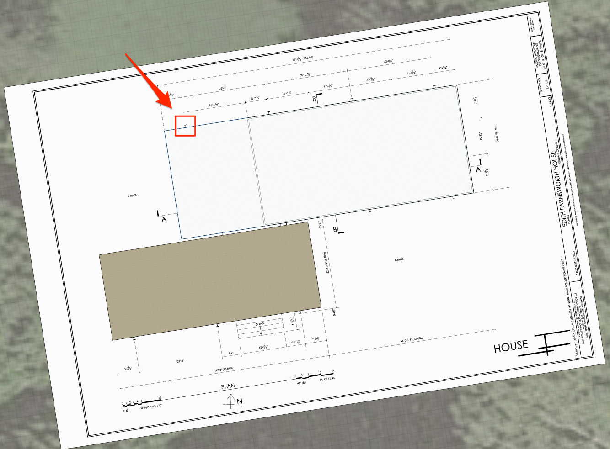
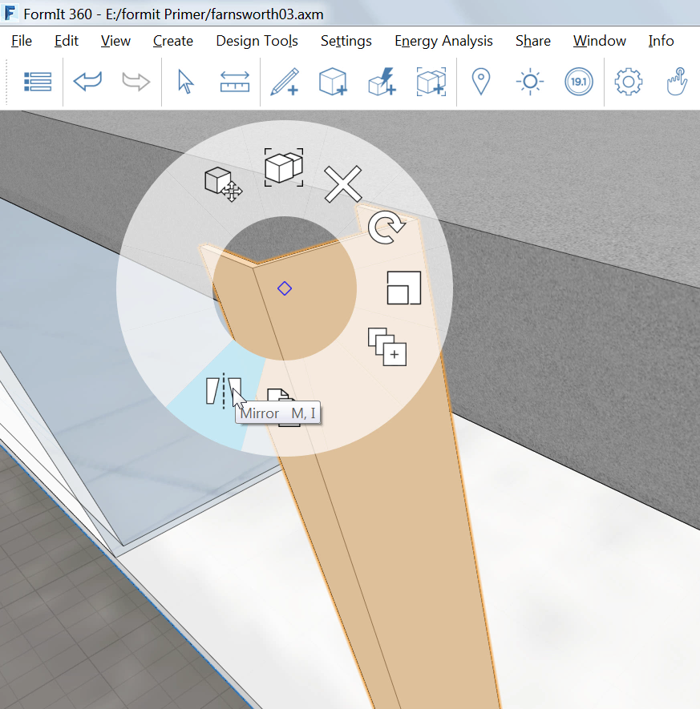
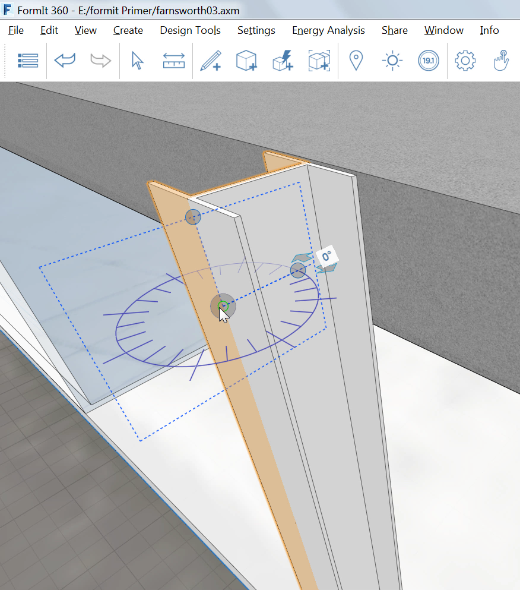
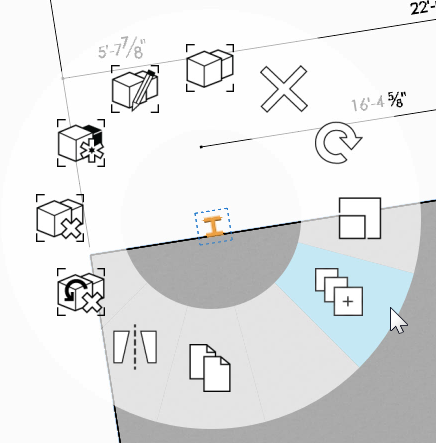
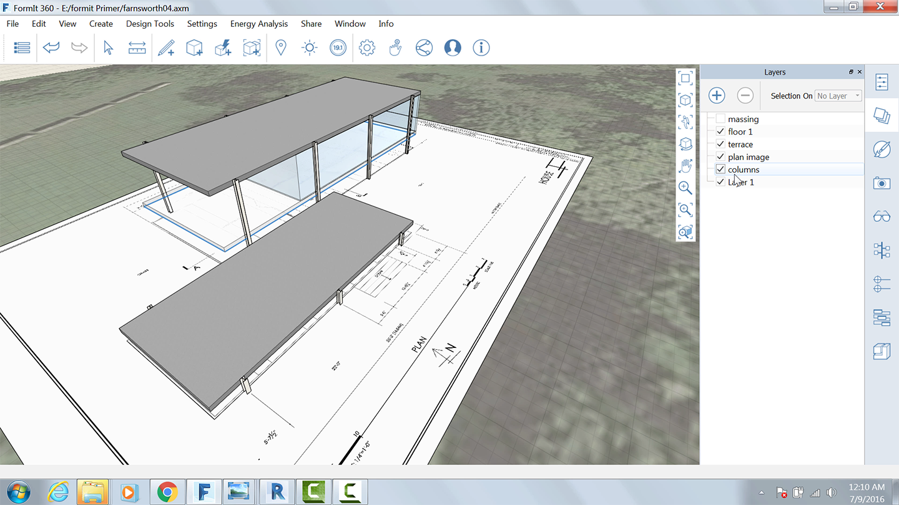

### 配列を使用した柱の作成

---

> 直前の演習がまだ完了していない場合は、[FormIt Primer フォルダ](https://autodesk.app.box.com/s/thavswirrbflit27rbqzl26ljj7fu1uv/1/9025446442)から **farnsworth03.axm** ファイルをダウンロードして演習を完了してください。

---

1. 平面図上に柱が描画されている位置まで、図面の左上をズーム表示します。

2. [**線分ツール(L)**](../formit-introduction/tool-bars.md)を使用して、次のようにスケッチします。

3. 上記の形状を作成したら、**その形状を押し出し**、スナップ機能を使用して屋根の最上部にスナップします。

4. 対象のオブジェクトをダブルクリックして選択します。[**鏡像ツール(MI)**](../tool-library/mirror.md)を右クリックして選択します。

5. 鏡像ウィジェットを移動し、柱の垂直方向のエッジにスナップして「I」字型の形状を作成します。

6. エッジをクリーンアップして、単一のソリッドな形状を作成します。

7. 柱をグループ化し、そのグループを編集して「**Column Tall**」という名前を付けます。次に、[カテゴリ]メニューで**[一般モデル]******を選択します。

8. マテリアルの**[メタル] > [陽極酸化 – 白]**を使用して、柱の読み込みとペイントを行います。

### 柱を配列する

---

1. 柱グループを選択します。

2. [**配列ツール(AR)**](../tool-library/tilt-array-copy-and-paste.md)を右クリックして選択します。

3. 次の設定を使用します。

* コピー間の長さ
* 直線
* コピーの数: 3

4. **[OK]**をクリックしてカーソルを右方向に移動し、赤い軸にカーソルを固定します。

5. [Tab]キーを押して「**22'**」と入力します。この操作により、4 本の柱の間隔が 22' に設定されます。

6. **最初の柱にカーソルを置いて****[Tab]キー**を押します。この操作により、4 本の柱がすべて選択されます。

7. 柱の配列操作を繰り返しますが、ここでは 4 本の柱すべてをまとめてコピーし、それらのコピーを建物の南側にスナップします。

### ユニークなグループを作成する

---

1. 建物南西側の 2 本の柱に対して、上記の手順 7 を繰り返します。

2. 建物南西側の 2 本の柱を、下部テラスの南側にコピーします。

3. コピーした両方のグループを**右クリック**し、**[ユニークにする(M U)]**を選択します。この操作により、コピーした両方の柱が新しいグループに属することになります。

4. 新しいグループのいずれかを編集し、「**Column short**」という名前を付けます。

5. グループを編集し、新しい柱の高さを下部テラスと同じ高さにまで下げます。新しい柱の高さは **3'-2”** にする必要があります。

6. 平面図のイメージをガイドとして参照しながら、[Column short]グループをさらに 2 回コピーします。この操作により、次の図のようになります。

