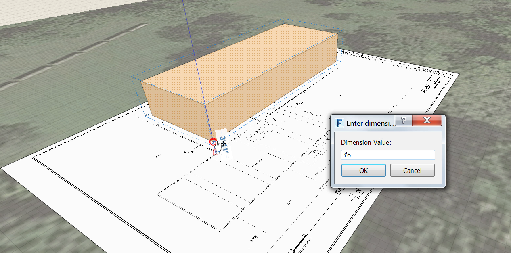
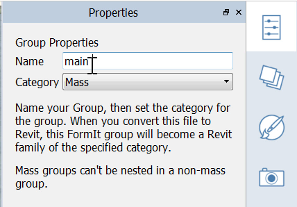

### グループ

---

> FormIt で直線やオブジェクトにスナップするたびに、論理和演算が実行されます。オブジェクトをグループ化すると、論理和演算を回避することができます。グループ化のメリットはこれだけではありません。グループをコピーした場合でも、元のオブジェクトへの接続はそのまま保持されます。グループのいずれかのコピーを編集すると、その編集内容がすべてのコピーに反映されます。この動作は、Revit の SketchUp インスタンスと Family インスタンスのコンポーネントの動作に似ています。

> 直前の演習がまだ完了していない場合は、[FormIt Primer フォルダ](https://autodesk.app.box.com/s/thavswirrbflit27rbqzl26ljj7fu1uv/1/9025446442)から **farnsworth02.axm** ファイルをダウンロードして演習を完了してください。

---

#### グループを作成、編集する

1. 既に作成されている**最初の長方形マス**を選択します。

2. **右クリック**して**[グループを作成(G)]**します。

3. 作成したグループをシングルクリックで選択します。グループ全体を上方向に **4'-6"** **移動**します。 Z 軸が表示されたら、**[Shift]キー**を押しながらグループを Z 軸に固定します。

4. これ以降の操作でさまざまなグループを使用することになるため、グループには必ず名前を付けてください。グループ名を指定するには、**ダブルクリック**で編集モードに切り替えて[**プロパティ パレット**](../tool-library/tool-bars-extended.md)を開きます。「**main building**」というグループ名を入力します。   

5. 左上に表示されている**チェック マーク**をクリックして編集モードを終了します。

**注**: *各グループには、[元に戻す]操作と[やり直し]操作を保管するための専用スタックがあります。これは、最上位レベル プロジェクトのスタックとは異なるスタックです。*

#### グループにレベルを適用する

---

1. **シングルクリックで[main building]グループを選択**し、パレット バーの[**プロパティ パレット**](../formit-introduction/tool-bars.md)を開きます。

2. **[レベルを使用]**オプションが有効になっているかどうかを確認します。 このオプションを有効にすると、選択したレベルによってマスが分割されます。**[すべてチェック]**をクリックします。

3. **[レベル別の領域]**に、現在選択されているオブジェクトの総面積と、各レベルの面積が表示されます。

4. オブジェクトに青いレベル線が表示されない場合は、**[設定メニュー] > [表示スタイル] > [レベルの表示(DL)]**に移動して設定を行ってください。   

