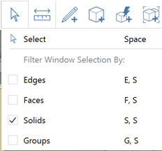
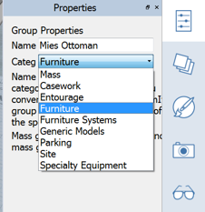

### 読み込み、書き出しとコンテンツ ライブラリ

---

> このセクションでは、各種のツールを使用して、FormIt 360 データの読み込みと書き出しを行う方法について説明します。

> 直前の演習がまだ完了していない場合は、[FormIt Primer フォルダ](https://autodesk.app.box.com/s/thavswirrbflit27rbqzl26ljj7fu1uv/1/9025446442)から **farnsworth06.axm** ファイルをダウンロードして演習を完了してください。

---

#### 躯体と家具の読み込み

1. [ファイル] > [読み込み] > [3D モデルの読み込み] ([Ctrl]+[I])をクリックし、FormIt Primer/content/components フォルダから **core.axm** を読み込みます。

2. **[Floor 1]レイヤを非表示**にして、平面図イメージを表示します。

3. 平面図をイメージとして使用して、大まかな位置に**躯体を移動**します。

4. [ファイル] > [読み込み] > [3D モデルの読み込み] ([Ctrl]+[I])をクリックし、FormIt Primer/content/SKP フォルダから **mies_ottoman.SKP** ファイルを読み込み、このファイルを居住領域内に**配置**します。

5. **[ottoman]グループ**を選択し、**[すべてグループ化を解除(U A)]**を右クリックして選択します。 この操作により、ネストされたすべてのグループのグループ化が解除されます。 

6. グループ化が解除された ottoman ジオメトリを選択します。この操作を簡単に実行するには、**[選択フィルタ]**ツールを使用して**[ソリッドのみ]**を選択します。 

7. ottoman ジオメトリをもう一度グループ化します。このグループを編集して「**Mies Ottoman**」という名前を付けます。 カテゴリ リストで**[家具]**を選択します。  

#### コンテンツ ライブラリを設定して使用する

---

1. [**コンテンツ ライブラリ パレット**](../formit-introduction/tool-bars.md)を開きます。

2. **[+]**アイコンをクリックして、ローカルのコンテンツ ライブラリのパスを作成します。 **FormIt Primer¥content** フォルダを選択して[OK]をクリックします。

3. メニューで **Content フォルダ**を選択します。   

4. **Seating サブフォルダ**を選択します。   

5. **[椅子-Corbu]**を選択し、この椅子インスタンスを **2 つ**配置します。

