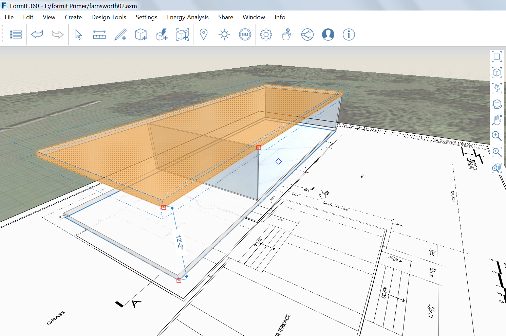

### マテリアル

---

> 直前の演習で説明したように、FormIt では、面にマテリアルを適用することができます。この演習では、自分専用のマテリアルを作成して編集する方法と、Autodesk Materials Library からマテリアルを読み込む方法について説明します。

---

#### ガラス壁を作成する

1. [**長方形ツール(R)**](../tool-library/rectangle-tool.md)を使用して、床の上に別のサーフェスを作成します(**28'-8" x 55'-5 ½"**)。

2. 作成したサーフェスを **11'-2"** の位置まで引き上げます。

3. サーフェスをグループ化して「**Glass Walls**」という名前を付けます。

4. 上部サーフェスを右クリックして[**面のオフセット ツール(OF)**](../tool-library/extrude-cut-and-offset-faces.md)を選択します。

5. **[Tab]キー**を押して「**4"**」を入力します。

#### 新しいマテリアルを読み込む

---

1. **[Glass Walls]グループ**をダブルクリックして編集します。

2. [**マテリアル パレット**](../formit-introduction/tool-bars.md)を選択します。

3. **[マテリアルを読み込む]ボタン**を選択します。   

4. Materials Library のメニューで**[ガラス]**を選択し、次に**[青 反射]**を選択します。

5. 読み込んだ[青 反射]マテリアルを**右クリック**して**[マテリアルによるペイント]**を選択します。 次に、**[Glass Walls]グループをダブルクリック**してマテリアルを適用します。

**注**: *[元に戻す]操作や[やり直し]操作と同様に、マテリアルの適用と編集はグループ単位で実行されます。*

1. **[Floor 1]グループをコピー**し、そのコピーを**[Ctrl]キー**を押しながら**ドラッグ**します。

2. コピーしたグループをユニークなグループにして、「**Roof**」という名前を付けます。 マテリアルの**[コンクリート] > [白]**を使用して、床の読み込みとペイントを実行します。

3. 平面図に従い、長方形ツール(R)を使用して、**長さ 55' 3"、幅 22'-7 3/4"** のテラスを作成し、そのテラスを **1'** だけ押し出します。 次に、このテラスをグループ化して「**Lower Terrace**」という名前を付けます。

4. テラスを、地面から **2'-2"** の距離に移動します。

5. マテリアルの**[石] > [石灰華]**を使用して、[Floor 1]グループと[Lower Terrace]グループの読み込みとペイントを実行します。

6. 両方のグループで、[石灰華]マテリアルを編集します。**[色の値]**をクリックして、値を **190** に変更します。これにより、マテリアルの色が明るくなります。

