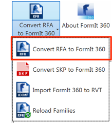

### Revit ファミリを変換して FormIt で使用する

---

1. Revit 2016 または 2017 を起動し、建築テンプレートで空のファイルを開きます。

2. FormIt 360 Converter の[アドイン]タブで、**[RFA から FormIt 360 に変換]**を選択します。

3. 最初のパスを **FormIt Primer¥content¥RFA** に設定し、変換後のファイルのパスを **FormIt Primer¥content** に設定して[OK]をクリックします。

4. この処理には数分かかります。これは、最初のパスのすべての RFA を Revit で開き、それらの RFA を FormIt 360 で読み込み可能な形式に変換する必要があるためです。

**注**: *必要な変換処理はすべて完了しているため、このチュートリアルでこの変換処理を実行する必要はありません。 これまでの演習で使用した Corbu 椅子などのコンテンツは、この変換処理から取得されたものです。*

#### FormIt から Revit にデータを読み込む

---

1. Revit のアドインで、**[FormIt 360 から RVT に読み込む]**を選択します。

2. FormIt Primer フォルダで **farnsworth07.axm** を選択します。

3. この処理には数分かかります。これは、FormIt ファイル内のすべてのオブジェクトが、Revit 内で個別のマス ファミリ インスタンス、一般ファミリ インスタンス、家具ファミリ インスタンスに変換されるためです。

4. 各種のオブジェクトを調べてみると、その多くがマス ファミリであることがわかります。ただし、柱は一般ファミリです。ファミリを編集して、構造柱などの別のカテゴリに変換することができます。

5. さまざまな家具オブジェクトが家具カテゴリに属しています。これまでの演習で変換したファミリと自動的に交換することができるツールがもう 1 つあります。アドインで**[ファミリを再ロード]**を選択します。

6. ダイアログで **FormIt Primer¥content.** フォルダを選択します。これにより、このフォルダ内のすべてのサブフォルダで変換プログラムが参照されるようになります。 [OK]をクリックします。 この処理には数分かかります。これは、すべてのファミリを確認して、適切な RFA ファイルをそのファミリ用に再ロードするためです。

#### Revit から FormIt にデータを書き出す

---

反復作業を行う設計領域を必要とする既存の Revit プロジェクトを使用する場合など、Revit のデータを FormIt に取り込みたい場合があります。そうした場合は、Revit の 3D シーン データを SAT ファイル形式で書き出すことにより、そのデータを FormIt にもう一度読み込むことができます。

**注**: *ファミリ情報とカテゴリ情報については、FormIt 360 用に変換されることはありません。*

