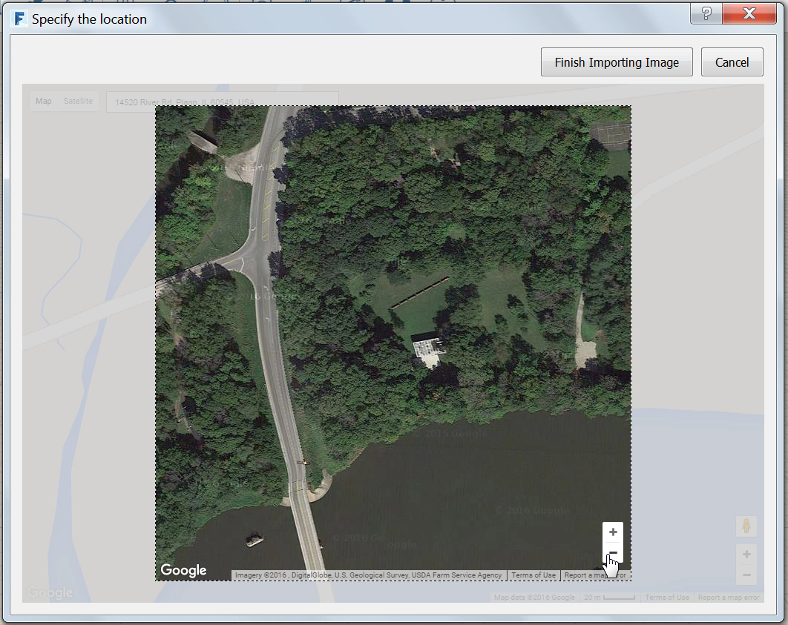
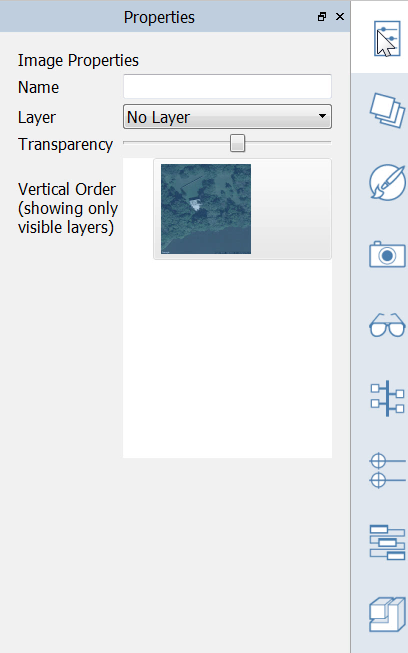

### 位置を設定する

---

> 下流工程での解析を正確に実行するには、プロジェクトの位置を地球上の実際の地点に設定することが重要になります。位置を設定することにより、スケールが調整された衛星画像を読み込んで、参照情報として使用できるようになります。

---

#### 位置を設定するには

1. *ファンズワース邸*の位置を設定します。
* 検索フィールドに「***Farnsworth House***」と入力します。 Google マップにより、実際の位置が設定されます。
* 位置検索を実行すると同時に、その位置を中心とするビューが表示されます。

2. **[完了]**をクリックすると位置が設定され、3D シーンに戻ります。 必要な場合は、倍率が調整された衛星画像を読み込むこともできます。
* **[衛星画像を読み込む]**をクリックした後で**[読み込みを終了]**をクリックします。
* 衛星画像が真北を上にして読み込まれ、スケールが変更されます。
* [**表示スタイル パレット**](../tool-library/tool-bars-extended.md)に移動して**[北向き矢印]**を有効にし、真北を示す対話型インジケータを表示します。
* 3D シーンに戻り、ダブルクリックして**衛星画像を選択**します。 [**プロパティ パレット**](../tool-library/tool-bars-extended.md)を開き、透過度スライダの値を **1/3** くらい下げます。

