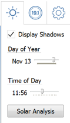

### 日照解析とエネルギー解析

---

> 直前の演習がまだ完了していない場合は、[ファイル] > [開く]をクリックし、FormIt Primer フォルダで **farnsworth07.axm** を選択して演習を完了してください。

---

#### 影

プロジェクトの位置を設定すると、影の動きや影がプロジェクトに与える影響を正確に解析できるため、適切な判断を行うことができるようになります。

1. [**アクション ツールバー**](../formit-introduction/tool-bars.md)の太陽アイコンをクリックして**[影を表示]**を選択します。

2. 日付スライダと時刻スライダを移動して、影の影響を確認します。この建物では、夏の最も暑い時間帯に、ひさしの付いたテラス部分が日陰になることがわかります。もちろん、これは偶然ではなく、そうした設計になっているためです。   

#### 日照解析

1. 同じ[**太陽メニュー**](../formit-introduction/tool-bars.md)で**[日照解析]**をクリックします。

2. 調査するサーフェスをクリックして**[解析]**をクリックします。

3. [月のピーク]設定に、その月のピーク時の日射量が BTU/sq ft の単位で表示されます。解析済みのサーフェスにマウス カーソルを置くと、そのサーフェスに対する日射量の値が表示されます。

4. [累積年]設定には、年間の累積エネルギー量が KwH/sq. m の単位で表示されます。 これは、設計のサーフェスでどの程度の太陽光発電が可能かを大まかに判断する場合に便利です。

### Insight 360 を使用したエネルギー解析

1. マスを除くすべてのレイヤを非表示にします。

2. **[Insight 360] > [Insight を作成]ボタン**をクリックします。レベルが適用されたすべての表示可能なマスが解析用として Insight 360 に送信されます。   

3. 解析が完了したら、[Insight を表示]をクリックして解析結果を確認します。必要に応じて、Insight 360 の Web サイト([http://insight360.autodesk.com](http://insight360.autodesk.com/))に直接アクセスすることもできます。

