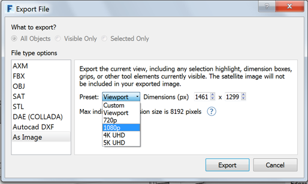

### 表示設定

---

> 直前の演習がまだ完了していない場合は、[FormIt Primer フォルダ](https://autodesk.app.box.com/s/thavswirrbflit27rbqzl26ljj7fu1uv/1/9025446442)から **farnsworth07.axm** ファイルをダウンロードして演習を完了してください。

---

#### シーン

1. 以下に示すシーンに一致するようにカメラをナビゲートします。

2. [**シーン パレット**](../formit-introduction/tool-bars.md)を開き、[+]を 2 回クリックして 2 つのシーンを追加します。

3. 現在のシーンの名前を「**Southwest Ground**」に変更し、別のシーンの名前を「**Aerial**」に変更します。

4. カメラを移動して、次の図のように上空からのビュー(Aerial)を表示します。

5. この上空からのシーンを 1 回クリックし、次に更新アイコンをクリックします。 この操作により、カメラの現在の視点にシーンが固定されます。

6. [シーンのプロパティ]チェックボックスを使用して、シーンの設定に対する変更をシーンに反映させるかどうかを指定します。   

7. 再生ボタン  をクリックして、各シーンを順に再生します。

#### 表示設定

1. **[Southwest Ground]**シーンをダブルクリックして選択します。

2. [**表示スタイル パレット**](../formit-introduction/tool-bars.md)を選択します。

3. 各チェックボックスを使用して、各項目の表示スタイルを設定します。スライダを使用すると、通常のエッジとシルエット エッジの比率を変更することができます。

4. **[単色のサーフェス]**オプションを有効にします。 この操作により、シーン内のすべての項目が単色で表示されます。以下の図を参照してください。

#### イメージを書き出す

表示スタイルを使用して 1 つまたは複数のシーンを作成したら、そのシーンの高解像度イメージを書き出すことができます。

1. **[ファイル] > [書き出し] ([Ctrl]+[E])をクリックします**。

2. リストで**[イメージとして]**を選択します。

3. [プリセット]リストで目的の解像度を選択するか、カスタムのピクセル サイズを入力します。

