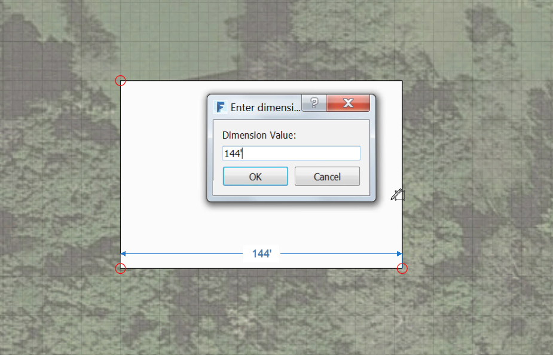
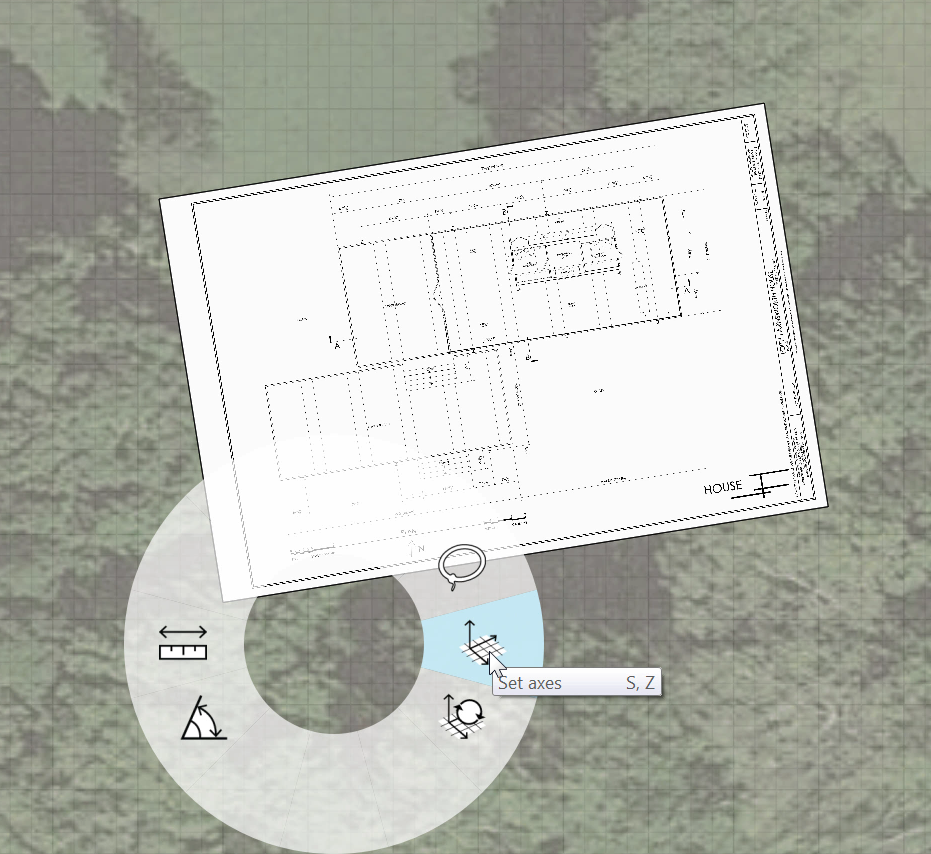

### イメージと地盤面を使用する

---

[ファイル] > [読み込み]メニューを使用して、PNG イメージを地盤面上に読み込むことができます。ただし、スケールと位置をより正確にコントロールするため、ここでは平面上にマテリアル テクスチャを配置します。**plan.png** イメージのサイズは、幅が 3600 ピクセルで高さが 2400 ピクセルです。 平面上でスケールを計測すると、1' は 25 ピクセルであることがわかります。この値を使用して、シーン内のイメージを正確にスケーリングすることができます。

1. [**長方形ツール(R)**](../tool-library/rectangle-tool.md)を選択し、サイズが **144'** X **96'** の長方形を描画します。正確なサイズを入力するには、**[Tab]キー**を押します。

2. [**マテリアル パレット**](../formit-introduction/tool-bars.md)を開き、**[+]**アイコンをクリックして新しいマテリアルを作成します。

3. **フォルダ アイコン**をクリックし、FormIt Primer/Drawings サブフォルダ内の **plan.png** イメージを開きます。

4. [水平スケール]フィールドに **144'**、[垂直スケール]フィールドに **96'** をそれぞれ入力し、マテリアルの名前として「**Floor Plan**」と入力します。

5. **[OK]**をクリックしてシーンに戻ります。 [**マテリアル パレット**](../formit-introduction/tool-bars.md)で[Floor Plan]マテリアルを**右クリック**して**[マテリアルによるペイント]**を選択し、スケッチした**平面をクリック**します。

6. **平面全体**を**ダブルクリック**して選択し、 [**回転ツール(Q)**](../tool-library/placing-and-modifying-objects/rotate.md)を**右クリック**して選択します。 次に、回転ウィジェットを画面左下隅に移動し、イメージを**左方向に 9 度**回転します。

7. **地盤面**上で**右クリック**[**[軸を設定(SZ)]**](../tool-library/world-axes.md)を選択し、 イメージの左下隅に軸を移動します。次に、平面の角度に一致するように軸を移動します。この操作により、地面のグリッドがイメージに一致するため、3D のスケッチを簡単に行うことができます。

