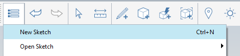
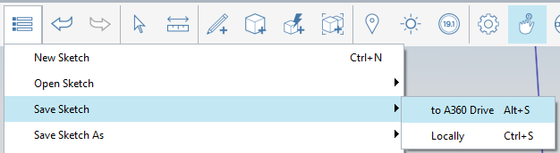

### プロジェクトをセットアップする

---

> FormIt の主要な保管メディアは Autodesk 360 ドライブです。ただし、ローカル ドライブのファイルを操作する(開く、保管する、読み込む、書き出す)こともできます。ここでは、ローカル ドライブからファンズワース邸のデータベースをロードしますが、これ以降の演習では、A360 ドライブのアカウントを使用して FormIt にログインし、作業内容を A360 ドライブに保存していきます。

---

#### FormIt 360 をダウンロード、インストール、起動する

1. [**このページ**](prerequisites-and-installation.md)に記載されている手順に従って FormIt 360 のダウンロードとインストールを行い、FormIt 360 を起動します。

2. [**アクション ツールバーのユーザ ID メニューで、自分の Autodesk 360 資格情報を使用して **](tool-bars.md)**FormIt にログイン**します。   

3. **[ギャラリー]ボタン > [新規]**をクリックして、新しいスケッチを開始します。

* **[ギャラリー]ボタン > [スケッチを保存] > [A360 ドライブへ]**をクリックして、A360 ドライブの FormIt フォルダにスケッチを保存します。
* FormIt スケッチに名前を付けます。
* A360 ドライブに保存するたびに、次の 2 つの処理が実行されます。
* ネイティブの FormIt ファイル(.AXM)が、A360 の FormIt フォルダに保存されます。
* 数分後に、設計の RVT ファイルが A360 の FormIt フォルダにコピーされます。これ以降の演習で、FormIt を起動する別の方法を確認します。

4. [**アクション ツールバーの設定メニュー**](tool-bars.md)を使用して、**[単位]**を[インチ/フィート]または[メートル]に切り替えます。

---

#### 関連項目

[作業面を変更する](../tool-library/work-planes.md)

[ワールド軸を変更する](../tool-library/world-axes.md)

