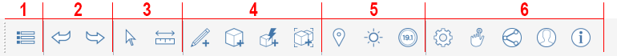
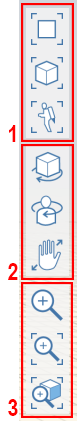

### ツールバー

---

---

#### アクション ツールバー

アクション バーは、画面の上部に表示されます。アクション バーの各種ツールを使用して、コンテンツの作成、編集、共有を行うことができます。

1. ギャラリー メニュー
2. 元に戻す/やり直し
3. 選択/計測
4. 作成/修正ツール
5. 位置/解析ツール
6. ユーザ ID
#### ナビゲーション ツールバー

1. シーン ビュー モード
2. 3D ビュー ツール
3. ズーム ツール
#### パレット バー

1. プロパティ
2. マテリアル
3. レイヤ
4. シーン
5. 表示スタイル
6. グループ ツリー
7. Dynamo
8. レベル
9. コンテンツ ライブラリ
10. Undo マネージャ

