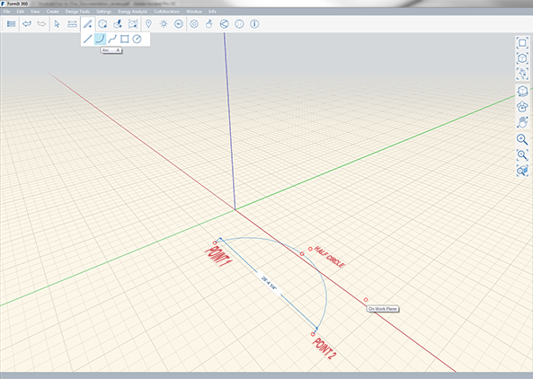
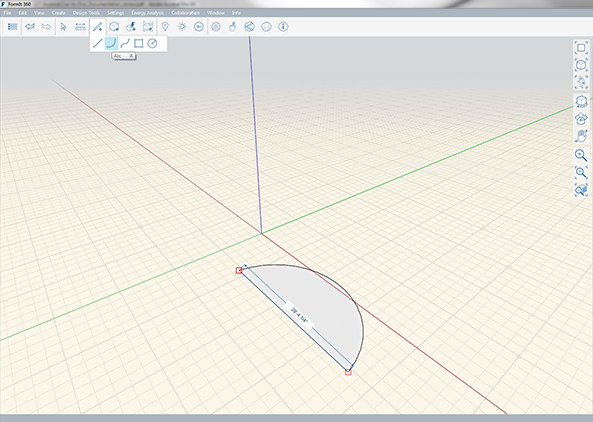

### 円弧ツール

---

> 半円や左右対称の円弧を作成するには、円弧ツールを使用します。

---

円弧を作成するには、3 つの点を指定します。X 軸、Y 軸、Z 軸上で円弧を描画することができます。最初の点を指定したら、その点から次の点までの距離を決定し、3 つ目の点を指定して円弧の高さを決定します。スナップ先となる半円の点が自動的に表示され、この点にスナップすると、最初に指定した 2 つの点を結ぶ線を直径とする円弧が作成されます。

2 つ目の点の次の位置を指定する際に、最初の点と 2 つ目の点との距離を確認することができます。この距離を手動で指定するには、**[Tab]キー**を押します。

円弧を描画したら、[線分ツール](line-tool.md)を使用して、最初の点と 2 番目の点を接続して面を作成することができます。

