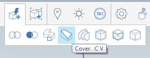
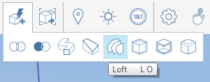
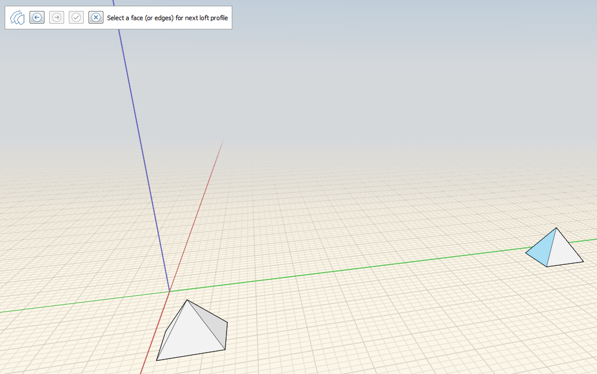

### かぶり、スイープ、ロフト

---

> この演習では、開いているエッジを囲む方法、エッジのパスに沿ってジオメトリを変更する方法、複数のプロファイルやエッジを接続する方法について説明します。

---

#### 一連の面を囲むには

1. アクション バーでかぶりツールをクリックします。   

2. 囲むオブジェクトのエッジをクリックします。

3. [完了]  をクリックします。   

#### パスに沿ってジオメトリを変更するには

1. 切り取るオブジェクトの面をマークします。

2. スイープ ツール アイコンをクリックします。   

3. 上の手順でマークした面を選択します。

4. 切り取るエッジを選択します。

5. [完了]アイコンをクリックします。 元のオブジェクトが、スイープ パスに沿って変更されます。

#### 複数のプロファイルまたはエッジを接続するには

1. [ロフト]アイコンをクリックします。   

2. 最初のオブジェクトのエッジをクリックした後で矢印をクリックします。

3. 2 番目のオブジェクトのエッジをクリックします。

4. [完了]  をクリックします。

