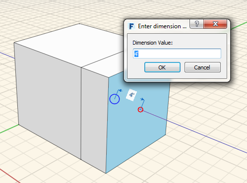

### 削除、編集、移動する

---

> この演習では、オブジェクトの削除、オブジェクトの場所の移動、オブジェクトのプロパティの編集を行います。

---

#### 削除

最初に、削除するジオメトリを選択します。次に、コンテキスト メニューを右クリックして**削除ツール**をクリックします。 または、キーボードの[Delete]キーを押してもかまいません。

#### 編集

[移動]ツール、[配列]ツール、[面をプッシュ/プル]ツール、[オフセット]ツールなどの編集ツールを使用する場合、青い寸法ボックスが表示されます。操作が完了したらこの寸法ボックスをクリックし、特定の値を入力します。[Tab]キーを押すと、[寸法値を入力]ダイアログが表示されます。このボックスで値を入力することもできます。

#### エッジ、面、オブジェクトを移動する

最初に、移動するエッジ、面、またはオブジェクトを選択します。自動的に移動ツールが起動します。マウスを操作してスナップと推定配置点を表示し、移動操作の開始位置を指定してクリックします。これにより、移動操作が開始されます。次に、オブジェクトの移動先となる位置にマウスを置き、スナップと推定配置点を表示します。もう一度クリックすると、オブジェクトが配置されます。

