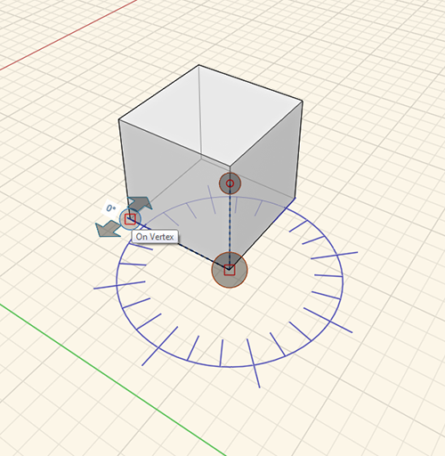
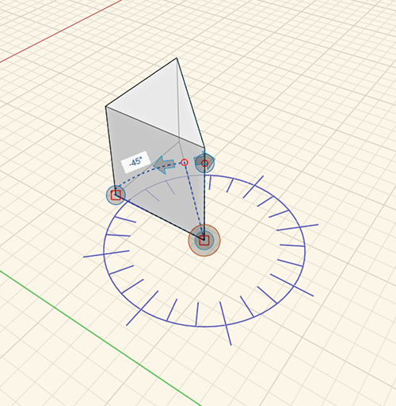

### [角度を計測]ツール

---

> [角度を計測]ツールは、[アクション ツールバー](../formit-introduction/tool-bars.md)に組み込まれています。

---

[角度を計測]ツールを使用して、頂点、エッジ、面、体積間の角度を計測することができます。また、計測した値を使用して、ジオメトリの寸法を調整することもできます。

* アクション ツールバーで[角度を計測]ツールを選択するか、ショートカットキーの**[M]、[A]** を使用して開始点を指定します。
* ドラッグ ハンドルをクリックして、開始位置の頂点までドラッグします。
* 矢印を使用して、点と点の間の角度を計測します。
* ジオメトリを変更するには、変更する面やエッジをクリックし、表示された角度をクリックして新しい角度を入力します。
* **最終的な結果:** 

