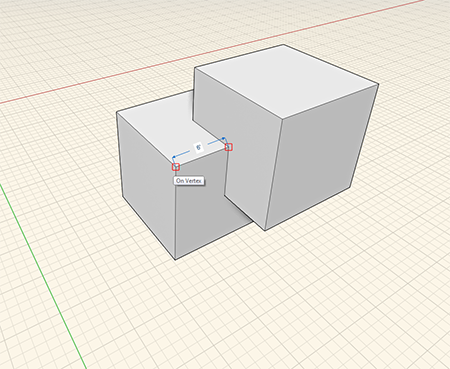

### 計測ツール

---

> 計測ツールは、[アクション ツールバー](../formit-introduction/tool-bars.md)に組み込まれています。

---

計測ツールを使用して、既にモデル化されているジオメトリを計測することができます。また、計測した値を使用して、ジオメトリの寸法を調整することもできます。

1. 計測ツールを選択して、2 点間の距離を計測します。
2. 長さを変更する面またはエッジを選択し、数値をクリックして新しい長さを入力します。  

