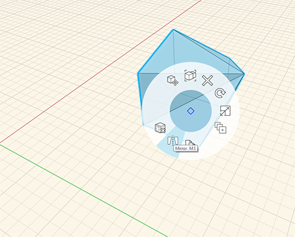

### 鏡像

---

> ここでは、オブジェクトを鏡像化する方法について説明します。

---

オブジェクトを鏡像化するには、クリック操作でオブジェクト全体を選択します。鏡像化を開始するには、オブジェクトを右クリックして、[鏡像]を選択するか、**[M]、[I]** と入力します(1)。 オブジェクトを鏡像化するための軸を示す平面図が表示されます(2)。この平面図を移動または回転して、鏡像の軸をカスタマイズすることができます。

1. 
2. 
3. 

