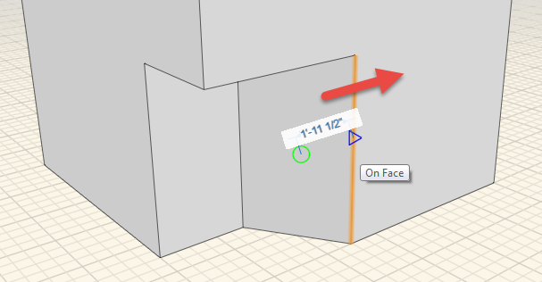
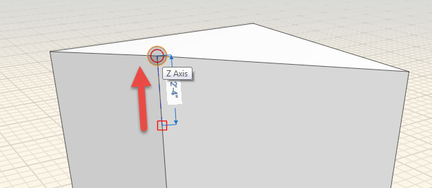

### 面、エッジ、点の修正

---

> 配置したオブジェクトをプッシュ操作やプル操作で変更する方法を理解すると、さまざまな操作を実行できるようになります。旧バージョンの FormIt とは異なり、単一の面、エッジ、点をシングルクリックで選択できるようになりました。

---

#### 面を修正する

1. オブジェクトのいずれかの面を[**シングルクリックで選択**](select-edge-face-or-object.md)します。

2. 選択した面をドラッグして、**プッシュ**操作(面を押し込む操作)や**プル**操作(面を引き出す操作)をすぐに実行することができます。 個別のツールを起動する必要はありません。**スナップ機能**を使用して、シーン内の他のオブジェクトに合わせて面をスナップすることができます。

3. 面を移動する場合は、**仮寸法**をクリックするか**[Tab]キー**を使用して、移動する距離を指定します。

4. **[Delete]キー**を使用して面を削除することもできます。または、面を**右クリックして[X]ボタン**を選択しても、面を削除することができます。
#### エッジを修正する

1. 任意の立方体のいずれかのエッジをシングルクリックします。

2. いずれかの軸に沿ってエッジをドラッグして形状を変更します。

3. 以下の操作により、エッジを削除することもできます。

* エッジを選択して**[Delete]キー**を押す。
* エッジを**右クリックして[X]ボタンをクリックする**。

#### 点を修正する

1. 任意の立方体のいずれかの角を[シングルクリック](select-edge-face-or-object.md)します。

2. エッジの場合と同様に、いずれかの軸に沿って点をドラッグして形状を変更します。

