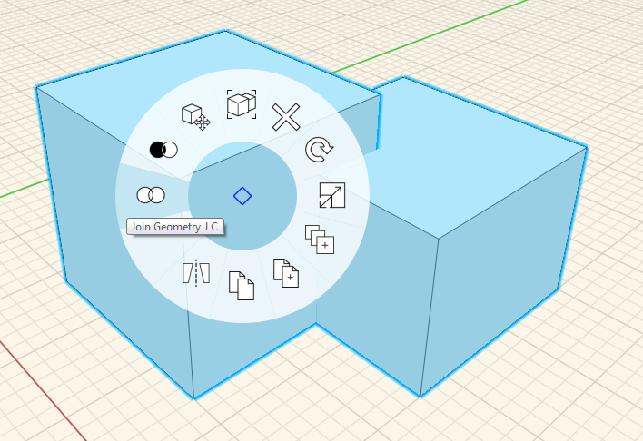

### ブール論理差とブール論理和

---

1. 作成したいずれかの立方体をダブルクリックして選択します。

2. 選択した立方体を、別の立方体に重なるように移動します。

3. 次のいずれかの方法で、両方の立方体を選択します。

* **[Ctrl]キー**を押しながら**ダブルクリック**する。
* シーン内で**左クリック**して**ドラッグ**することにより、標準の交差窓を使用する。
* シーン内で右クリックして**投げ縄ツール**を選択し、さらに詳細な選択項目を表示する。

4. **切り取り**を行うには、切り取るオブジェクトを右クリックし、コンテキスト メニューで[**切り取りツール**](tool-library/boolean-operations.md)を選択します。 

5. **結合**を行うには、結合するいずれかのオブジェクトを右クリックし、コンテキスト メニューで[**結合ツール**](tool-library/boolean-operations.md)を選択します。

