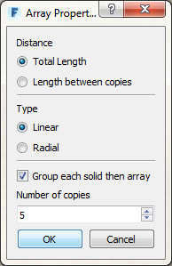

### オブジェクトのコピー

---

オブジェクトをコピーするには、次に示す 3 つの方法があります。 最初に、コピーするオブジェクトを**ダブルクリック**して選択します。

1. 立方体を右クリックします。 次に、コンテキスト メニューの[**コピー ツール**](tool-library/tilt-array-copy-and-paste.md)を選択し、シーン内の任意の場所(ただし、コピーするオブジェクトを除く)を右クリックして**[貼り付け]ボタン**を選択します。 **[Ctrl]+[C]**または**[Ctrl]+[V]**キーを使用した場合も、同じ動作になります。

2. **[Ctrl]キーを押したまま**、オブジェクトをドラッグします。この方法により、ドラッグ操作でオブジェクトをコピーすることができます。

3. 立方体を**右クリック**し、[**配列ツール**](tool-library/tilt-array-copy-and-paste.md)を選択します。 配列ツールを使用して、コピーの数を選択することができます。また、次のドラッグ操作で、2 つのオブジェクト間の距離を指定するかどうか、配列全体の長さを指定するかどうかを選択することもできます。   

