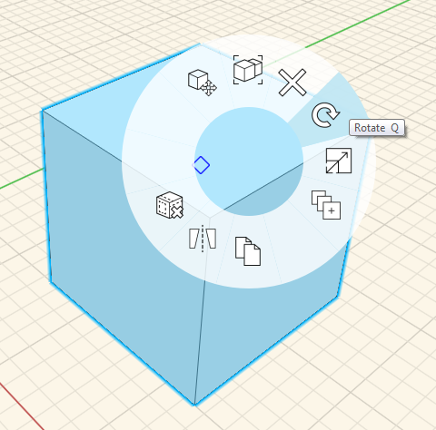
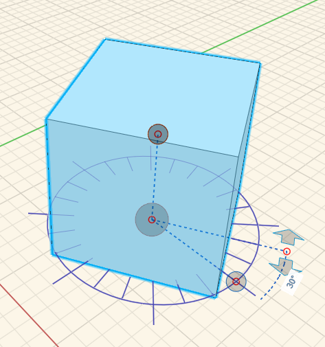

### 回転する

---

> オブジェクトの向きを変えることができます。

---

要素を選択して右クリックし、コンテキスト メニューで回転ツールを選択します。マウスを操作して分度器グラフィックを表示し、クリック操作で平面図を回転用に設定します。回転の始点を指定するには、青いグリップを使用します。必要に応じて、軸をリセットすることができます。矢印または編集可能な寸法ボックスを使用して、回転角度を設定します。要素を選択した後で[Q]キーを押しても、回転ツールにアクセスすることができます。

 

