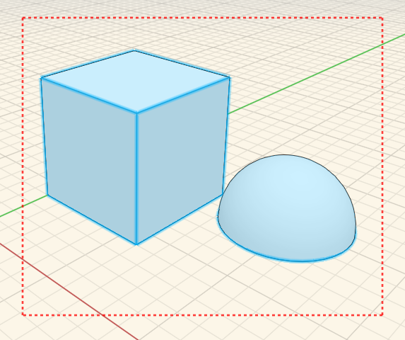
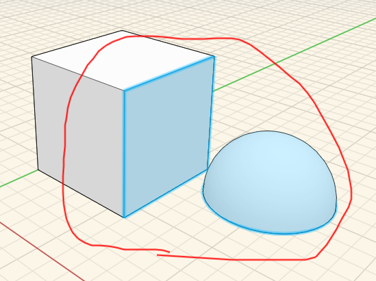

### エッジ、面、オブジェクトの選択

---

> オブジェクトやサーフェスを修正するには、最初にそのオブジェクトやサーフェスを選択する必要があります。

---

**面、エッジ、または頂点**を選択するには、対象の面、エッジ、または頂点にマウス カーソルを置いてシングルクリックします。

**オブジェクト全体を選択**するには、対象のオブジェクトをダブルクリックします。

**複数のジオメトリをまとめて選択**するには、ウィンドウ選択ツールを使用します。 何も選択されていない状態で、マウスをクリックして左右どちらかにドラッグすると、複数のジオメトリをまとめて選択することができます。

複数のジオメトリを**より正確に選択**するには、投げ縄ツールを使用します。 空のキャンバス内を右クリックすると、コンテキスト メニューに投げ縄ツールが表示されます。投げ縄ツールを使用して、対象となる選択領域を囲むように線を描画します。

 

