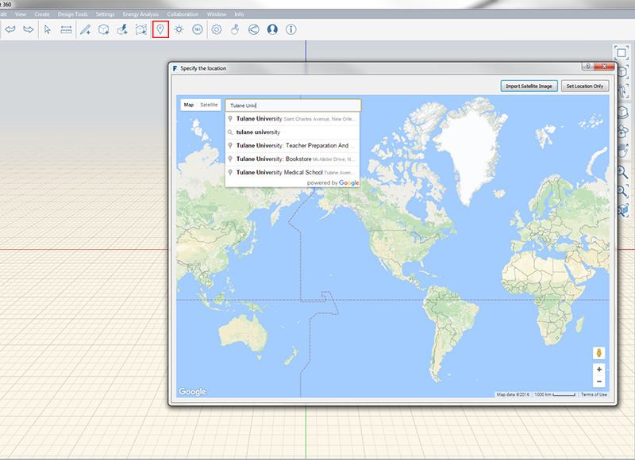

### 位置を設定する

---

> 下流工程での解析を正確に実行するには、プロジェクトの位置を地球上の実際の地点に設定することが重要になります。位置を設定することにより、スケールが調整された衛星画像を読み込んで、参照情報として使用できるようになります。

---

位置を設定するには、最初に A360 アカウントにサインインする必要があります。サインインすると、位置(LS)機能を使用できるようになります。

* FormIt 360 Pro では、上記の他に最初に、*[位置を指定]*ウィンドウの左上隅にある検索ボックスでプロジェクトの位置を入力します。
* プロジェクト サイトの位置を設定し、読み込む衛星画像が決まったら、**[イメージの読み込みを終了]**をクリックします。
* 衛星画像が真北を上にして読み込まれ、スケールが変更されます。読み込んだ画像の外観を変更するには、画像をダブルクリックして[**プロパティ パレット**](../formit-introduction/tool-bars.md)に移動します。

