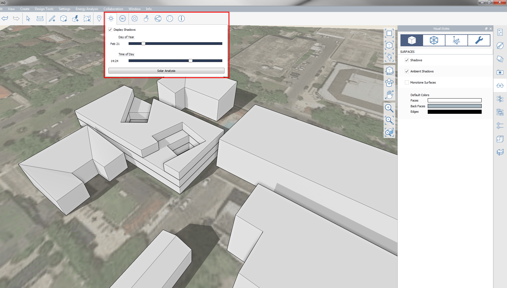

### 影

---

> この機能を使用すると、太陽の軌道がプロジェクトに与える影響を正確に調べることができます。現場の環境がプロジェクトにどのように影響するのか、プロジェクトが現場の環境にどのように影響するのかを予測することができます(ここでは、現場の環境のことを「コンテキスト」と呼びます)。

---

影を正確に調査するには、最初に[**プロジェクトの位置を設定**](setting-location.md)する必要があります。 プロジェクトの位置を設定し、スケールが調整された衛星画像を読み込んだら、プロジェクト、コンテキスト、樹木をモデル化します。[**コンテンツ ライブラリ パレット**](../formit-introduction/tool-bars.md)を使用して既存のコンテキスト モデルを呼び出すと、すばやく調査を行うことができます。

* 次に、影が有効になっているかどうかを確認します。これは、[**表示スタイル パレット**](../formit-introduction/tool-bars.md)で確認することができます。

* [**アクション ツールバー**](../formit-introduction/tool-bars.md)で*[太陽と影]ボタン*をクリックします。 この操作により、日付と時刻を調整するためのボックスが表示されます。

* プレゼンテーション用として、調査結果の画面ショットを書き出すことができます。また、シーンを使用して、画面ショットをアニメーションにすることもできます。

