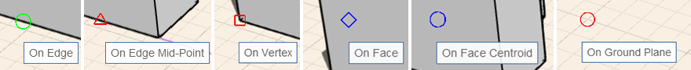
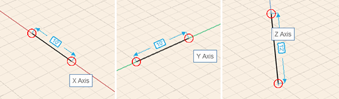

### スナップと推定配置点

---

> スナップと推定配置点を使用すると、スケッチとモデリングを簡単に実行できるだけでなく、ジオメトリの作成、配置、編集も正確に行うことができます。描画を行う軸として、任意の軸を選択して使用することができます。この軸で、サーフェスの押し出しなどの操作を実行することもできます。

---

**注:** *ソフトウェアの各種ツールを使用する場合に便利な[キーボード ショートカット](../Appendix/keyboard-shortcuts.md)に関する情報を参照してください。* 

#### スナップする

スケッチやモデリングを行う際に、いくつかのスナップを使用することができます。オブジェクトへのスナップは、自動的に有効になります。次に示すスナップ先にスナップすることができます。

* エッジ
* 中心点
* 頂点上の端点
* 面上
* 面の中心
* 地盤面

グリッドにスナップするには、[設定]メニューの[グリッドにスナップ]をオンにする必要があります。

#### 推定配置点

推定配置点の選択機能は常に有効になっているため、ジオメトリの動作を制限することができます。

**軸:** X 軸、Y 軸、Z 軸に沿ってジオメトリを移動することができます。 X 軸の推定配置点は赤、Y 軸の推定配置点は緑、Z 軸の推定配置点は青で表示されます。

**軸のロック:** X 軸、Y 軸、Z 軸に沿って動作をロックすることができます。 軸の推定配置点で[Shift]キーを押したまま、マウスを移動して別の要素の推定配置点にスナップします。

**平行:** 既存の要素に対して平行に、ジオメトリのスケッチや移動を行うことができます。 垂直方向の推定配置点は紫色で表示されます。水平方向の参照情報として使用する線にマウス カーソルを置く必要があります。

**垂直:** 既存の要素に対して垂直に、ジオメトリのスケッチや移動を行うこともできます。 垂直方向の推定配置点は紫色で表示されます。垂直方向の参照情報として使用する線にマウス カーソルを置く必要があります。

**任意の点からの延長:** 推定配置点を使用して、任意の点参照から延長することができます。 参照情報として使用する点にマウス カーソルを置いてツールチップを表示し、その点から伸びる推定軸を使用します。

