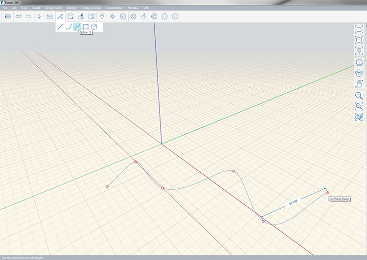

### スプライン ツール

---

> スプライン ツールにより、空間内や他のオブジェクト上で有機的なスケッチを作成することができます。

---

スプラインは、3 つ以上の補間点によって描画されます。複数の点を指定すると、その点をつなぐようにして、滑らかで有機的なスプラインが描画されます。

描画中に、スプラインの長さを表示することができます。手動で長さを指定するには、**[Tab]**キーを押します。 スプラインを閉じると、面が作成されます。

