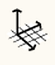

### ワールド軸

---

> ワールド軸を変更することにより、既定の座標系とグリッドを変更することができます。

---

#### 図面の軸とモデルの軸

空のスケッチを FormIt 360 で開くと、ワールド軸が画面の中心に赤、緑、青の 3 本線で表示されます。これらの 3 本の線は、3D ワールドを定義する 3 つの直交座標方向を示します。「X」方向は赤、「Y」方向は緑、「Z」方向(「上」方向)は青色の線で表示されます。

グリッドを回転するには、シーン内の空の領域を右クリックし、コンテキスト メニューで  を選択します。 赤色のドットをドラッグすると原点を移動でき、青色のドットをドラッグすると軸を回転できます。

座標系とグリッドを既定の設定にリセットするには、シーン内の空の領域を右クリックして  を選択します。

* **赤、緑、青の軸**を使用すると、ツールを終了することなく、3D でスケッチを続行することができます。

* **紫色の軸**は、現在描画している線に関連する軸を示しています。

* **現在の軸に線分セグメントを固定する**には、**[Shift]キー**を押しながら、その線分セグメントを現在の軸にドラッグします。

